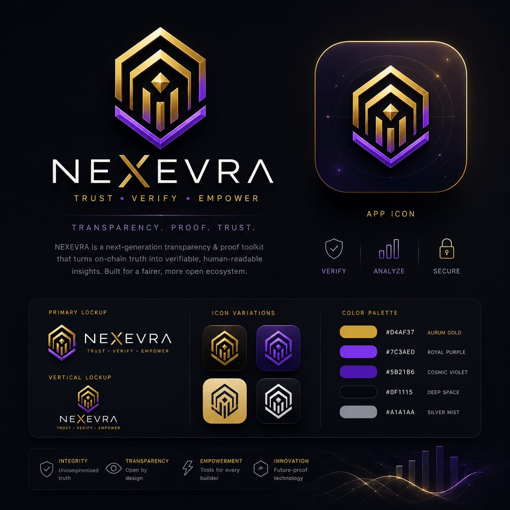

<div align="center">

# 🛡️ PiProof

### Verifiable proofs for the Pi ecosystem — PEP/1 protocol · Trust Policy Engine · AUREVIA dashboard

**Deterministic. Signed. Replay-proof. Zero dependencies.**

[](https://github.com/EslaM-X/piproof/actions/workflows/ci.yml)
[](#-license--copyright)
[](https://nodejs.org)
[](https://www.python.org)
[](#-zero-dependencies)
[](#-run-it-yourself)
[](https://github.com/EslaM-X/piproof#-adversarial-suite)
[](#-contributing)
[](https://github.com/EslaM-X)

</div>

---

> [!IMPORTANT]
> This is an **independent, community-built reference implementation**.
> It is **not** an official Pi Network product, and it makes no claim of
> endorsement by Pi Network or the Pi Core Team.

Reference implementation of **Programmable Engagement Proofs (PEP/1)** — a
deterministic, independently verifiable primitive for signed engagement
reporting, built from the review discussion in
[PiRC1 PR #2](https://github.com/PiNetwork/PiRC/pull/2).

It implements exactly what was discussed there, nothing more:

> *"it would be beneficial to provide APIs that allow apps to report more
> fine-grained engagement metrics. Apps would authenticate themselves using
> their app-specific API key. Participating users would be KYC-verified and
> migrated to Mainnet, which helps eliminate Sybil attacks."*

---

## 📑 Table of Contents

- [Why this exists](#-why-this-exists)
- [Features](#-features)
- [Run it yourself](#-run-it-yourself)
- [Demo](#-demo)
- [Adversarial suite](#-adversarial-suite)
- [Cross-language verification](#-cross-language-verification)
- [Architecture](#-architecture)
- [Project map](#-project-map)
- [Usage](#-usage)
- [Transparency Layer (v0.3)](#-transparency-layer-v03)
- [PiProof — portable verifiable proofs (v0.7.0)](#-piproof--portable-verifiable-proofs-v070)
- [AUREVIA Proof Passport (v0.8.0)](#-aurevia-proof-passport-v080)
- [AUREVIA Evidence Network (v0.9.0)](#%EF%B8%8F-aurevia-evidence-network-v090)
- [AUREVIA — product identity](#%EF%B8%8F-aurevia--product-identity)
- [Roadmap](#-roadmap)
- [Security](#-security)
- [Contributing](#-contributing)
- [License & Copyright](#-license--copyright)

---

## 🎯 Why this exists

| Review requirement (PR #2) | Where it lives here |
|---|---|
| canonical serialization rules frozen | `src/canonical.js`, SPEC §2 |
| app-specific API keys + rotation | `key_id` registry, `REVOKED_KEY` path |
| KYC / Mainnet eligibility gating | signed `eligibility` block + launchpad-side registry cross-check |
| bounded weights (no utility inflation) | class ceilings enforced even over valid signatures |
| replay protection | per-app nonce store, recorded only on full pass |
| deterministic validation | fixed 9-step pipeline, byte-stable canonical form |
| reproducible evidence | `vectors/` are byte-for-byte reproducible — regenerated and diff-gated in CI |

## ✨ Features

| | Feature | Detail |
|:---:|---|---|
| 🔒 | **Ed25519 signatures** | RFC 8032 via Node stdlib `node:crypto` |
| 🧊 | **Frozen canonical JSON** | JCS-subset profile, integers only, byte-stable |
| 🔁 | **Replay protection** | per-app nonce store with **atomic test-and-set** (`claimIfAbsent`); burned only on full pass; durable fsynced file store with cross-process locking |
| ⚖️ | **Bounded weights** | class ceilings enforced *even over valid signatures* |
| 🪪 | **Registry-gated eligibility** | KYC/Mainnet flags checked server-side, never trusted from the payload |
| 🕵️ | **Privacy-preserving identities** | `pioneer_uid_hash` is a keyed HMAC-SHA256 tag (versioned `h1:`), NFC-normalized — rainbow-table-proof |
| 🎲 | **Deterministic key material** | optional seed → RFC 8032-fixed Ed25519 keys; committed vectors are **byte-for-byte reproducible** (CI-diffed) |
| 🔑 | **Key rotation & revocation** | `key_id` indirection, instant revocation path |
| 🧪 | **Adversarial suite** | 20 attacks, each rejected with its exact error code |
| 🌍 | **Cross-language verification** | every vector re-verified by an independent pure-Python Ed25519 verifier |
| 🎫 | **Evidence Passports** | 1–100 PiProofs under one content-addressed `evidence_root`, pseudonymous subject, shareable via URL fragment |
| ⚖️ | **Dispute Engine** | claim→verdict adjudication chain; three honest outcomes: VALID / INVALID / UNVERIFIABLE — never a false pass |
| 🔀 | **Cross-application proofs** | independent issuers share one verifier epoch; multi-issuer passports verify against a single trusted state |
| 🤖 | **Agent Evidence** | AI accountability: signed agent actions become portable, independently verifiable audit trails |
| 📦 | **Zero dependencies** | runtime uses Node.js stdlib only — no supply-chain surface |

---

## 🚀 Run it yourself

```bash
git clone https://github.com/EslaM-X/piproof.git
cd piproof

npm test          # unit + integration tests        → 91/91 ✔
npm run attacks   # adversarial suite               → 20/20 rejected ✔
npm run demo      # end-to-end walkthrough          → deterministic verdicts
```

Requires **Node ≥ 18**. Nothing else. No `npm install`.

For the independent Python verifier (standard library only):

```bash
npm run gen:vectors && python scripts/cross-verify.py
# CROSS-VERIFICATION OK (pure Python): 1 valid accepted, 20/20 attacks rejected
```

## 🎬 Demo

```
$ node src/cli.js demo
[1] backend signs a high-value engagement event (class A, weight 50)
[2] verifier checks it against the launchpad registry
  PASS  SCHEMA
  PASS  APP_KNOWN
  PASS  KEY_ACTIVE
  PASS  CANONICALIZATION
  PASS  SIGNATURE
  PASS  TIMESTAMP_FRESHNESS
  PASS  WEIGHT_BOUND
  PASS  ELIGIBILITY
  PASS  NONCE_REPLAY

VERDICT: PASS (deterministic)

[3] attacker replays the exact same payload
  VERDICT: REJECT [REPLAY_DETECTED]

[4] attacker mutates the weight after signing
  VERDICT: REJECT [INVALID_SIGNATURE]
```

## ⚔️ Adversarial suite

Every attack is a committed test vector with an expected rejection code:

| # | Attack | Rejected with |
|---|---|---|
| 01–02 | replay / nonce reuse | `REPLAY_DETECTED` |
| 03–05 | forged signature / weight & user mutation after signing | `INVALID_SIGNATURE` |
| 06–07 | stale timestamp / future timestamp | `TIMESTAMP_EXPIRED` / `TIMESTAMP_IN_FUTURE` |
| 08 | weight inflation beyond class ceiling | `WEIGHT_OVERFLOW` |
| 09 | unknown application | `UNKNOWN_APP` |
| 10 | revoked signing key | `REVOKED_KEY` |
| 11 | cross-app key forgery | `INVALID_SIGNATURE` |
| 12–14 | missing field / unknown field injection / unsupported version | `SCHEMA` |
| 15 | self-declared eligible user | `INELIGIBLE_USER` |
| 16 | unknown key claim | `UNKNOWN_KEY` |
| 17–18 | registry says kyc/mainnet = false despite signed claims | `INELIGIBLE_USER` |
| 19 | unregistered pioneer | `INELIGIBLE_USER` |
| 20 | app id set to an object-prototype property name | `UNKNOWN_APP` |

```
RESULT: 20/20 attacks rejected
```

## 🌍 Cross-language verification

Trust one implementation? No. Every vector produced by the Node pipeline is
re-verified by `scripts/cross-verify.py` — an independent, dependency-free
implementation of RFC 8032 Ed25519 and the verification pipeline, written
from scratch against the Python standard library only.

This catches the bugs that survive inside a single codebase: wrong curve
arithmetic, divergent canonicalization, endianness mistakes. CI runs both
verifiers on Linux and Windows, across Node 18/20/22 and Python 3.10/3.12.

---

## 🏗️ Architecture

```
                 ┌──────────────────────────────────────────────┐
   event.json ──►│  closed schema ─► canonical bytes (frozen)   │
                 │                        │                     │
                 │                        ▼                     │
                 │              "PiRC1-PEP-v1\n" + bytes        │
                 │                        │                     │
                 │                        ▼                     │
   backend key ─►│                  Ed25519 sign                │──► signed envelope
                 └──────────────────────────────────────────────┘

                 ┌──────────────────────────────────────────────┐
 signed envelope►│ 1 SCHEMA          6 TIMESTAMP_FRESHNESS       │
   registry    ─►│ 2 APP_KNOWN       7 WEIGHT_BOUND             │
   nonces      ─►│ 3 KEY_ACTIVE      8 ELIGIBILITY (registry!)  │
   now         ─►│ 4 CANONICALIZATION 9 NONCE_REPLAY            │
                 │ 5 SIGNATURE                                  │
                 └──────────────────────┬───────────────────────┘
                                        ▼
                            { ok, code, checks[] }
                             deterministic verdict
```

The 9 steps always run in this order. A failure short-circuits with its code;
a pass records the nonce exactly once.

## 🗺️ Project map

```
piproof/
├── src/
│   ├── constants.js     protocol parameters & error codes
│   ├── canonical.js     closed-profile JSON canonicalization (JCS subset)
│   ├── schema.js        closed-schema validator (normative)
│   ├── events.js        event construction + Ed25519 signing
│   ├── keys.js          key generation (RFC 8032 via node:crypto)
│   ├── registry.js      app/key registry + eligibility registry
│   ├── nonces.js        InMemory + file-backed nonce stores (atomic claimIfAbsent)
│   ├── redis-nonces.js  ★ distributed nonce store — zero-dep RESP2 client (v0.11)
│   ├── verify.js        ★ the deterministic 9-step pipeline
│   ├── escrow.js        SIGNING_AUTHORITY_REVOKED attestations (v0.3)
│   ├── pfloor.js        dynamic price floor + invariant health (v0.3)
│   ├── engagement.js    PoA/PoU scoring + consistency factor (v0.3)
│   ├── dashboard.js     deterministic snapshot assembly (v0.3)
│   ├── piproof.js       ★ PiProof/1 portable proof envelope + verifier (v0.7)
│   ├── policy.js        Trust Policy Engine — post-crypto acceptance (v0.7)
│   ├── passport.js      ★ AUREVIA-Evidence-Passport/1 (v0.8)
│   ├── dispute.js       ★ Dispute Engine — claim→verdict chain (v0.9)
│   ├── attacks.js       the adversarial suite
│   └── cli.js           keygen / init-reg / sign / verify / proof-* / passport-* / dispute
├── app/
│   ├── index.html       AUREVIA dashboard · Explorer · Passport · Dispute · Agent Evidence
│   ├── server.mjs       Node host: snapshot + sample/issue/verify/dispute APIs
│   └── verify.html      public verification page (/verify#p=<document>)
├── schema/
│   └── engagement-event.schema.json   JSON Schema description
├── scripts/
│   ├── gen-vectors.mjs  regenerate all vectors byte-for-byte deterministically
│   ├── check-vectors.mjs re-check committed vectors
│   ├── bench.mjs        ★ reproducible throughput benchmark (v0.11)
│   └── cross-verify.py  🐍 independent pure-Python RFC 8032 verifier
├── test/
│   ├── canonical.test.js      canonicalization properties
│   ├── verify.test.js         pipeline incl. registry gating
│   ├── trust-boundary.test.js what a lying issuer can & cannot do
│   ├── attacks.test.js        the full adversarial matrix
│   ├── hardening.test.js      atomicity, durability, reproducibility, pollution
│   ├── cli.test.js            CLI end-to-end
│   ├── transparency.test.js   p_floor / invariant / engagement / escrow / snapshot
│   ├── piproof.test.js        portable proofs + policy engine
│   ├── passport.test.js       Evidence Passport unit suite
│   ├── passport-api.test.js   HTTP APIs incl. cross-issuer & agent evidence
│   ├── dispute.test.js        dispute chain three-state honesty
│   └── redis-nonces.test.js   distributed store vs RESP fixture (child proc)
├── vectors/
│   ├── valid/signed-event.json        the one true positive vector
│   ├── registry.json                  vector world state
│   └── attacks/*.json                 20 attack vectors + expected codes
├── docs/
│   └── OPEN_QUESTIONS.md  ★ the honest register — ten hard questions, answered
├── .github/workflows/ci.yml           Node × OS matrix + Python cross-verify
├── SPEC.md             normative specification
├── SECURITY.md         threat model & explicit limitations
└── TRACEABILITY.md     PR #2 requirement ↔ code ↔ test ↔ attack mapping
```

## 💻 Usage

```bash
# backend side
node src/cli.js keygen    --out keys/dev.json
node src/cli.js init-reg  --out registry.json --app acme-app
node src/cli.js add-key   --registry registry.json --app acme-app --key-id k1 --pub keys/dev.json

# verifier side
node src/cli.js sign   --event event.json --key keys/dev.json --out signed.json
node src/cli.js verify --event signed.json --registry registry.json --nonces nonces.jsonl

# portable proofs (v0.7)
node src/cli.js proof-export --event signed.json --registry registry.json --out proof.json
node src/cli.js proof-verify --proof proof.json --registry registry.json --policy policy.json

# evidence passports (v0.8)
node src/cli.js passport-create --proof proof.json [--proof p2.json …] \
  --subject alice-demo --policy policy.json --out passport.json
node src/cli.js passport-verify --passport passport.json --registry registry.json

# dispute engine (v0.9)
node src/cli.js dispute --doc passport.json --registry registry.json --out dispute-report.json

# or, once installed (`npm i -g .`), documents can be passed positionally:
npx piproof passport-verify proof-passport.json --registry registry.json
npx piproof dispute dispute-report.json --registry registry.json

# horizontal scaling (v0.11): share replay state across N verifier instances
import { RedisNonceStore } from './src/redis-nonces.js';
const nonces = new RedisNonceStore({ url: process.env.REDIS_URL, ttlMs: 86_400_000 });
// same synchronous interface — verifySignedEvent/verifyPiProof just work
```

```bash
npm run bench   # reproducible throughput: ~7.3k proofs/sec single-core sequential, p50 0.125ms
```

Library API:

```js
import { newEvent, signEvent } from './src/events.js';
import { verifySignedEvent } from './src/verify.js';
import { InMemoryNonceStore } from './src/nonces.js';

const result = verifySignedEvent(signedEnvelope, {
  registry,              // launchpad-controlled: apps, keys, eligible users
  nonceStore,            // shared state across your verifier fleet
  now                    // injectable clock => fully testable
});
// => { ok, code, checks: [{ check, pass }, ...] }
```

## 📊 Transparency Layer (`v0.3`)

The ideas endorsed in the PiRC1 review — **dynamic `p_floor`**, **`x·y=k`
invariant tracking**, **escrow lock status**, and the **"Transparency
Dashboard"** concept — are implemented as pure, side-effect-free modules on
top of the PEP/1 trust layer:

| Module | Endorsed idea it implements |
|---|---|
| [`src/pfloor.js`](src/pfloor.js) | `p_floor = (R·Q)/(R+S)²` recomputed in real time from circulating supply; invariant health report that flags any liquidity extraction |
| [`src/engagement.js`](src/engagement.js) | PoA/PoU composite × Consistency Factor; per-project weight manifests clamped to protocol ceilings (weigh down, never up) |
| [`src/escrow.js`](src/escrow.js) | offline-verifiable `SIGNING_AUTHORITY_REVOKED` attestations under a dedicated signature domain, bound to the revoked key's fingerprint |
| [`src/dashboard.js`](src/dashboard.js) | one deterministic JSON snapshot fusing all four primitives for any "Transparency Dashboard" client |

```bash
npm run transparency   # end-to-end demo snapshot
npm run app            # live single-page Transparency Dashboard (localhost:8787)
```

### Pi SDK integration & UX highlights (`app/index.html`)

- **Official Pi SDK**: loads `pi-sdk.js`, `Pi.init({version:'2.0'})`, `Pi.authenticate(['username','payments'])` with graceful **preview mode** outside Pi Browser; a support payment flow (`Pi.createPayment`) demonstrates the U2A path.
- **Bilingual EN/العربية** with full RTL layout switch, persisted per user.
- Glassmorphism UI over an animated aurora · skeleton loaders · count-up numbers · reveal animations · toast notifications · medal ranks · HiDPI gradient-area canvas chart · `prefers-reduced-motion` respected · PWA manifest for standalone install.

## 🔐 PiProof — portable verifiable proofs (v0.7.0)

A PiProof wraps exactly one signed PEP/1 event so **any party can verify it
against their own registry copy without trusting the issuing app**.

```bash
# export a proof from a signed event
pep proof-export --event signed.json --registry registry.json --out proof.json

# verify anywhere — full checklist, deterministic verdict
pep proof-verify --proof proof.json --registry registry.json \
  --policy policy.json
```

```
 ✓ proof envelope well-formed
 ✓ registry root matches verifier epoch
 ✓ claim schema valid
 ✓ issuer registered
 ✓ signing key active (not revoked)
 ✓ deterministic canonical encoding
 ✓ Ed25519 signature valid
 ✓ timestamp fresh (within window)
 ✓ weight within class ceiling
 ✓ eligibility confirmed against registry
 ✓ nonce unused — no replay

VERDICT: TRUSTED PROOF — don't trust the app, verify the proof.
```

Optional **Trust Policies** (`src/policy.js`) narrow acceptance after
cryptographic validity: `issuer_allowlist`, `action_classes`,
`min_weight` / `max_weight`, `max_age_ms`, `require_kyc`,
`require_mainnet` — with rule-by-rule violations.

In AUREVIA: the **PiProof Explorer** verifies proofs live through the same
server code path, with a one-click Tamper Lab (mutate weight → invalid;
flip signature → invalid) and live replay catching. "Don't trust the app —
verify the proof."

## 🎫 AUREVIA Proof Passport (v0.8.0)

> **One portable evidence record. Independently verifiable anywhere.**
> *Proofs you can carry. Evidence anyone can verify.*

A passport bundles 1–100 PiProof envelopes under a single
content-addressed `evidence_root`, optionally bound to a pseudonymous
`subject` and a Trust Policy. The holder — not the platform — carries the
evidence: App A issues it, the holder takes it to App B, App C or an
auditor, and each verifies independently against their own trusted state.

```bash
# bundle signed proofs into a passport
pep passport-create --proof p1.json --proof p2.json \
  --subject alice-demo --policy policy.json --out passport.json

# verify anywhere — nested report, deterministic verdict
pep passport-verify --passport passport.json --registry registry.json
```

Verification layers: passport envelope → evidence-root recomputation →
every embedded proof's full checklist → passport-stored policy.
Replay detection propagates from any embedded proof to the final verdict.

In AUREVIA the Passport section lets you **Issue & Sign**, **Download
`.json`**, and share a verification link (`#p=…` URL fragment — no
server-side storage; anyone holding the link can re-verify). The Tamper
Lab applies to passports too: mutate anything inside and the evidence
root breaks before signatures are even checked.

**Trust boundaries are documented, not hidden:** registry authenticity,
nonce-store durability/distribution requirements, and audit status live in
[docs/TRUST_BOUNDARIES.md](docs/TRUST_BOUNDARIES.md). This project is not
externally audited; v1.0 remains blocked on external review.

## 🕸️ AUREVIA Evidence Network (v0.9.0)

> Proofs you can carry. Evidence anyone can verify.

```
                   ┌──────────────┐
                   │    PEP/1     │
                   │  Protocol    │
                   └──────┬───────┘
                   ┌──────▼───────┐
                   │   PiProof    │
                   │ Proof Engine │
                   └──────┬───────┘
        ┌─────────────────┼──────────────────┐
        ▼                 ▼                  ▼
  Proof Passport     Dispute Engine     Agent Evidence
        │                 │                  │
        └─────────────────┼──────────────────┘
                          ▼
                    AUREVIA Explorer
```

- **Public verification** — `/verify#p=<document>`: anyone opens the link;
  no account, no trust in the holder; full checklist → `PROOF VERIFIED ✓`.
- **Dispute Mode** — one adjudicable chain instead of screenshots:
  *CLAIM → who issued it? → what was signed? → which policy? → which epoch?
  → replayed? → key valid? → within policy? → FINAL VERDICT.*
  Three outcomes only: **VALID / INVALID / UNVERIFIABLE** — and
  UNVERIFIABLE (e.g. no trusted registry supplied) is never a pass.
  CLI: `pep dispute --doc passport.json --registry registry.json`.
- **Cross-application proofs** — multiple independent issuers share one
  verifier epoch; a single passport can carry App-A and App-B evidence.
- **Agent Evidence** — AI accountability: an agent's completed task is
  signed by its service, policy-checked, and becomes a portable audit trail.

## 🛡️ AUREVIA — product identity

> ### AUREVIA
> **Trust. Verified. Transparent.**
> Cryptographic transparency infrastructure for decentralized ecosystems.

AUREVIA is an independent product brand: an infrastructure / security-grade
visual language (deep navy-black · metallic gold · cryptographic shield mark ·
engineering typography). It is deliberately **not** a "${chain} fan app":
the Pi integration inside the dashboard is an *ecosystem adapter*, and the
brand can extend to other decentralized ecosystems without renaming.

| Element | Value |
|---|---|
| Brand | AUREVIA |
| Tagline | Trust. Verified. Transparent. |
| Product line | Cryptographic transparency infrastructure for decentralized ecosystems |
| Mark | cryptographic shield — [`app/assets/icon.svg`](app/assets/icon.svg) (favicon + maskable PWA icon) |
| Original artwork | preserved verbatim — [`app/assets/brand/identity-original.jpeg`](app/assets/brand/identity-original.jpeg) |

<p align="center">
  
</p>

Product focus stays fixed on one spine: **Evidence → Verification →
Transparency**. No tokens, no social features, no feature creep.

**Environment status:** Pi Browser-ready (`npm run app`). Mainnet listing is
pending Developer Portal registration and live-environment testing — claims
are kept at exactly that level until then.

Palette is driven by CSS custom properties (`--a1 #8a63ff`,
`--a2 #5aa7ff`, `--a3 #3ddc97`, `--gold #f5c451`) — re-theming is a
one-block edit.

> Pi, Pi Network and the Pi logo are trademarks of the Pi Community Company.
> This project is community-built and unaffiliated.


**Scope discipline:** these modules describe AMM mathematics over
caller-supplied reserves and verify authenticity of claims. They do not price,
value, endorse or promote any asset, and they never fetch chain state — the
optional attestation `anchor` field is a reference verifiers may resolve
themselves.

## 🧭 Roadmap

| Phase | Version | Scope | Status |
|---|---|---|---|
| I | `v0.1.x` | reference implementation, vectors, adversarial suite, cross-language verification | ✅ shipped |
| II | `v0.2` | conformance harness for third-party implementers, more vectors, fuzzed schema edges, hardening suite | ✅ shipped |
| III | `v0.3` | Transparency Layer: dynamic p_floor, invariant tracking, escrow attestations, dashboard engine, engagement scoring | ✅ shipped |
| — | `v0.5–v0.6` | transparency app hardening, AUREVIA identity & rebrand | ✅ shipped |
| V | `v0.7` | **PiProof**: portable proofs (`PiProof/1`), Trust Policy Engine, Proof Explorer, SHA-pinned CI, Pages deployment | ✅ shipped |
| VI | `v0.8` | **AUREVIA Proof Passport**: Issue/Export/Import/Verify/Share/Tamper/Report, evidence roots | ✅ shipped |
| VII | `v0.9` | **Evidence Network**: public verification page, Dispute Engine (VALID/INVALID/UNVERIFIABLE), cross-application proofs, Agent Evidence | ✅ shipped |
| VIII | `v0.10` | **Killer-demo perfection**: guided 60-second demo, issuer picker, short public links (`/p/<id>`), installable `piproof` CLI with positional args | ✅ shipped |
| IX | `v0.11` | **Distributed nonce state** (`RedisNonceStore` — zero-dep RESP client, atomic `SET NX`, TTL GC), reproducible throughput benchmark (`npm run bench`), honest open-questions register | ✅ shipped |
| X | `v0.12` | observability hooks, signed registry transparency-log design draft (the v1.0 review centerpiece) | 🔜 next |
| XI | `v1.0` | frozen after external review & public feedback cycle | 🔒 gated on review |

> `v1.0` will be tagged **only after** external security review and community
> feedback — not before.

## 🛡️ Security

Threat model, adversary capabilities, and explicit limitations are documented
in [SECURITY.md](SECURITY.md). The normative wire format lives in
[SPEC.md](SPEC.md). Requirement-to-evidence traceability:
[TRACEABILITY.md](TRACEABILITY.md). The ten hardest open questions about
this project — answered honestly, with status and what closes each one:
[OPEN_QUESTIONS.md](docs/OPEN_QUESTIONS.md).

**Trust boundary, in one line:** a valid signature proves authenticity of a
claim — never its truthfulness. Truth comes from the launchpad-controlled
registry; ceilings cap how much damage even a lying issuer can do.

Report vulnerabilities responsibly — see SECURITY.md for contact guidance.
Please do not open public issues for undisclosed vulnerabilities.

## 🤝 Contributing

The `main` branch is **protected**: all changes arrive through pull requests
and must pass the full CI matrix (Node × OS tests, adversarial suite, vector
regeneration, Python cross-verification) before merging.

```bash
git checkout -b feat/your-feature
npm ci 2>/dev/null || npm install   # dev-only tooling if any
npm run ci                          # full local gate before opening a PR
```

Keep PRs focused. If you change behavior, add or update the matching attack
vector and test first.

## 📜 License & Copyright

Licensed under the **[PiOS License](LICENSE)** — the Pi Open Source license that
permits unrestricted development and use of derivative works **within the Pi
Network ecosystem**, keeping this reference implementation dedicated to the
platform it was built for.

> Pi, Pi Network and the Pi logo are trademarks of the Pi Community Company.
> This project is community-built and is not affiliated with, endorsed by, or
> maintained by the Pi Core Team.

Copyright © 2026 **EslaM-X** 🇪🇬 · All rights reserved where applicable by the
chosen license terms.

---

<div align="center">

**Built as evidence, not as advertising.**
*Clone it. Run the suite. Check every claim above.*

⭐ If this reference implementation helped you evaluate PEP/1, consider starring the repo.

</div>
